## RISC-V openEuler 上 firefox 的测试报告

### 搭建环境

我使用的操作系统是 Arch Linux

1. 安装 QEMU

   ```bash
   sudo pacman -S qemu-full
   ```

2. 下载 openEuler RISC-V 系统镜像

   下载 [fw_payload_oe_qemuvirt.elf](https://mirror.iscas.ac.cn/openeuler-sig-riscv/openEuler-RISC-V/testing/20220622/v0.2/QEMU/fw_payload_oe_qemuvirt.elf) 和 [openeuler-qemu-xfce.raw.tar.zst](https://mirror.iscas.ac.cn/openeuler-sig-riscv/openEuler-RISC-V/testing/20220622/v0.2/QEMU/openeuler-qemu-xfce.raw.tar.zst) 以及 [start_vm_xfce.sh](https://mirror.iscas.ac.cn/openeuler-sig-riscv/openEuler-RISC-V/testing/20220622/v0.2/QEMU/start_vm_xfce.sh)

3. 启动 openEuler RISC-V 虚拟机

   ```bash
   tar -I 'zstdmt' -xvf ./openeuler-qemu-xfce.raw.tar.zst #解压镜像压缩包
   bash start_vm_xfce.sh #执行启动脚本
   ```

4. 创建普通用户

   在控制台登录 `root` 用户，密码为 `openEuler12#$`

   创建用户 `sihuan`，一并创建其家目录 `/home/sihuan`，并将其添加到 `wheel` 用户组

   ```bash
   useradd -m -G wheel sihuan
   ```
   
   为用户 `sihuan` 设置密码
   
   ```console
   # passwd sihuan
   New password:
   Retype new password:
   ```
   
   现在可以使用 `sihuan` 登入 xfce

### 搭建环境中遇到的问题

1. `sudo` 不能正常使用

   > 复现步骤
   >
   > 1. 按前文步骤启动 openEuler 虚拟机并创建普通用户
   >
   > 2. 使用普通用户登录
   >
   > 3. 执行 `sudo -l`
   >
   >    报错 `sudo: /usr/bin/sudo must be owned by uid 0 and have the setuid bit set`
   >
   > 
   >
   > 解决方案  
   >
   >    使用 `root` 用户执行
   >
   >    ```bash
   >    chmod 4755 /usr/bin/sudo
   >    ```

2. xfce 锁定后不能登录

   > 复现步骤
   >
   > 1. 按前文步骤启动 openEuler 虚拟机并创建普通用户
   >
   > 2. 使用普通用户登录 xfce
   >
   > 3. 不执行任何操作等待 xfce 锁定
   >
   > 4. xfce 锁定后重新尝试登录
   >
   >    报错 `Not permitted to gain access at this time.`
   >
   >    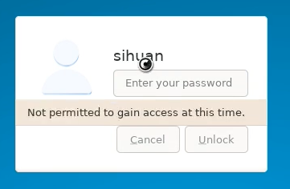
   >


### 测试 firefox

> 为了在干净的环境中进行测试，需要给 firefox 新建 profile，如果给每个测试样例都新建 profile 的话，一些测试的前置条件可能会需要复杂操作才能达成，所以将一些测试放在一个 profile 中按顺序测试。
>
> 预期结果中的截图，是在 Arch Linux 上的 firefox(102.0.1) 里按照操作步骤操作并进行的截图

#### 1. firefox 的安装

用例编号：TC00001

前置条件：启动 oE 虚拟机，使用普通用户登录 xfce

操作步骤：打开终端模拟器，执行

```bash
sudo dnf install firefox
```

预期结果：dnf 没有报错，firefox 成功安装，执行 `firefox --version` 可以输出 firefox 版本号

实际结果：dnf 没有报错，firefox 成功安装，执行 `firefox --version` 可以输出 firefox 版本号

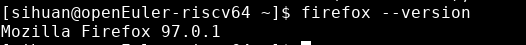

#### 2. firefox 的卸载

测试用例：TC00002

前置条件：firefox 已经成功安装

操作步骤：打开终端模拟器，执行

```bash
sudo dnf remove firefox
```

预期结果：dnf 没有报错，firefox 成功被卸载，执行 `firefox --version` 会报错 `bash: firefox: commad not found`

实际结果：dnf remove 报错

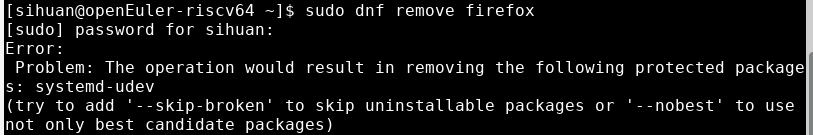 


#### 3. 搜索功能测试

**新建 profile 进行以下测试**（在 `about:profiles` 页面可以新建 profile）

3.1 地址栏搜索

测试用例：TC00003

前置条件：firefox 安装成功，从新建 profile 启动

操作步骤：

   1. 从终端执行 `firefox` 启动 firefox
   2. 在地址栏输入 `archlinuxcn` 
   3. 点击地址栏右侧右箭头

预期结果：成功打开搜索 `archlinuxcn` 关键字的 google 页面

实际结果：成功打开搜索 `archlinuxcn` 关键字的 google 页面

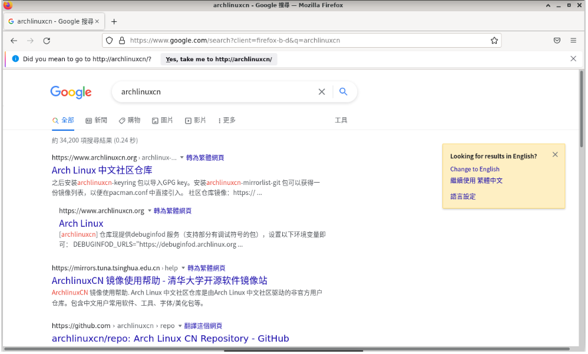

3.2 地址栏搜索历史

测试用例：TC00004

前置条件：完成 TC00003 测试

操作步骤：

   1. 点击新建标签页
   1. 在新标签页地址栏中输入 `archlinux`

预期结果：能够推荐历史搜索内容 `archlinuxcn`（前面有时钟图标的项目为历史项目）

实际结果：在第二项中推进历史搜索内容 `archlinuxcn`，可以通过 `tab` 或 `down` 按键来补全

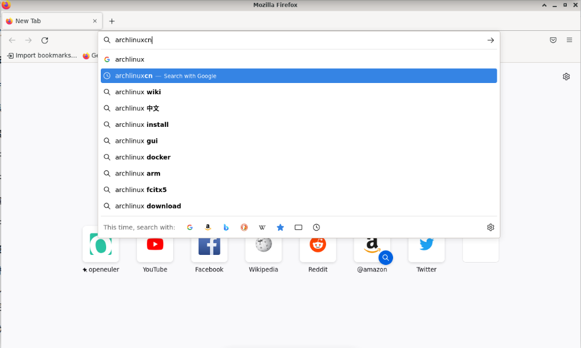

3.3 搜索框搜索

测试用例：TC00005

前置条件：成功安装 firefox，在 firefox 设置中设置 `Add search bar in toolbar`

操作步骤：

   1. 从终端执行 `firefox` 启动 firefox
   2. 在搜索框输入 `touhou project` 
   3. 点击搜索框右侧右箭头

预期结果：成功打开搜索 `touhou project` 关键字的 google 页面

实际结果：成功打开搜索 `touhou project` 关键字的 google 页面


3.4 搜索框搜索历史

测试用例：TC00006

前置条件：完成 TC00005

操作步骤：

   1. 新建标签页
   1. 在新建标签页搜索框中输入 `touhou`

预期结果：能够推荐 `touhou project` 的历史搜索项目

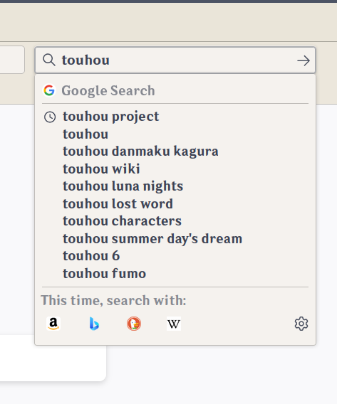

实际结果：能够在第二项显示历史记录

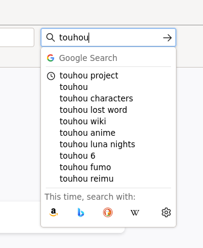

3.5 地址栏标签页搜索

测试用例：TC00007

前置条件：成功安装 firefox

操作步骤：

   1. 从终端执行 `firefox` 启动 firefox
   2. 在地址栏输入 `https://zh.moegirl.org.cn/Mainpage` 并按下回车
   3. 新建标签页，在新标签页地址栏输入 `moe`

预期结果：

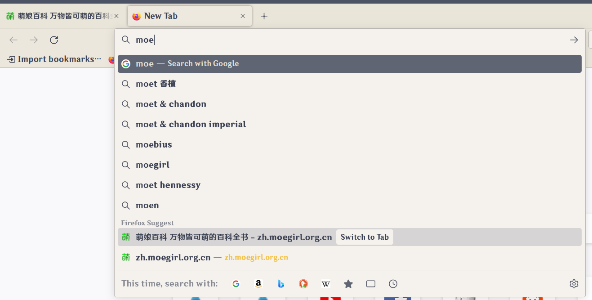

实际结果：在 Firefox Suggest 中可以看到 `Switch to Tab` 项目，点击可以切换到指定标签页

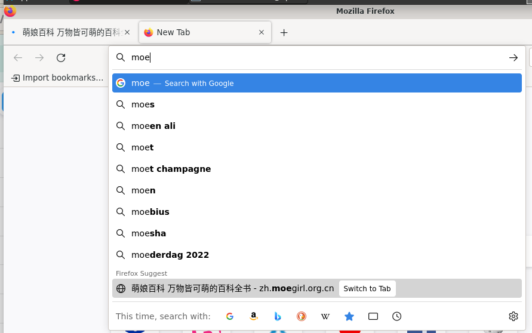

3.5 页面内查找

测试用例：TC00008

前置条件：firefox 成功安装

操作步骤：

1. 从终端执行 `firefox` 启动 firefox

2. 在地址栏输入 `https://wiki.archlinux.org/title/Installation_guide` 并按下回车

3. 按下 `Ctrl+F ` 快捷键，在页面底部的查找框中输入 `bio`

   然后依次打开再关闭 `Hightlight All` 、`Match Case`、`Whole Words` 选项

预期结果：输入 `bio` 后能够匹配三项搜索结果，并高亮第一项。打开 `Hightlight All` 选项后，其余项目以另一种颜色高亮。打开 `Match Case` 选项后，匹配零个结果，打开 `Whole Words` 选项后匹配零个结果。

实际结果：输入 `bio` 后能够匹配三项搜索结果，并绿色高亮标记第一项。

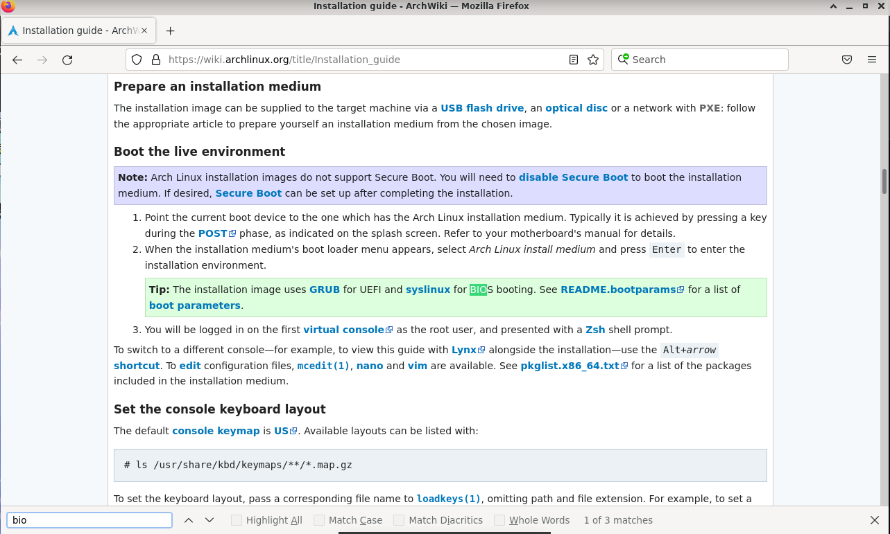

打开 `Hightlight All` 选项后，其余匹配项以紫色高亮显示。

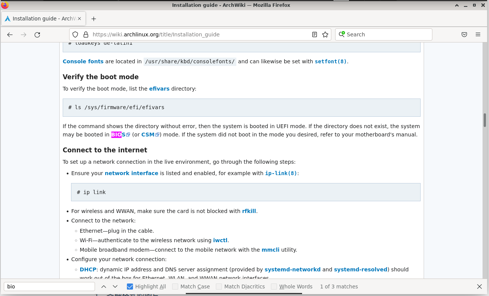

打开 `Match Case` 选项后，匹配零个结果。

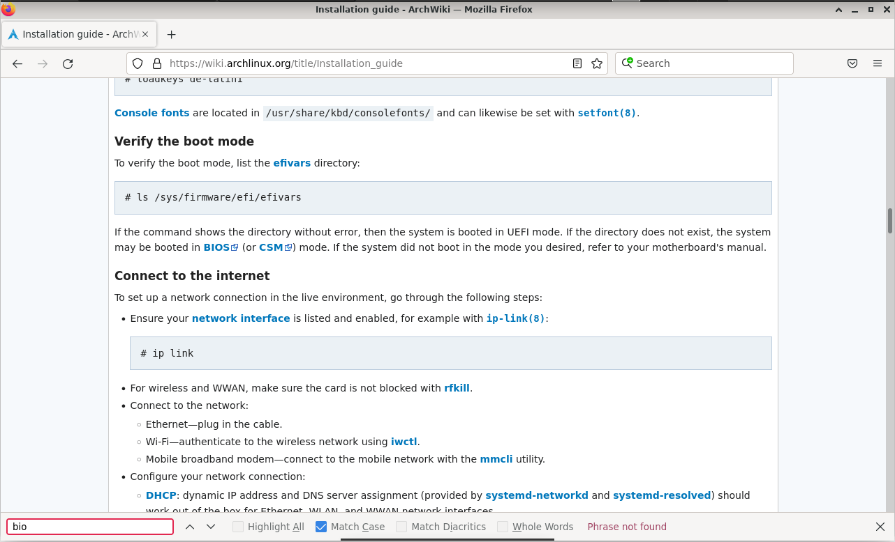

打开 `Whole Words` 选项后匹配了零个结果。

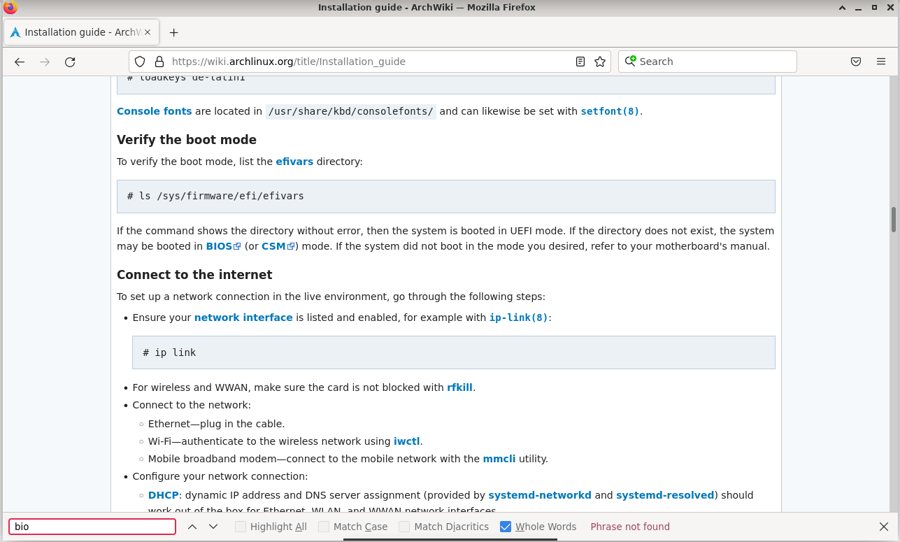

### TODO

1. 添加新建 profile 的测试
2. 写几个页面托管在 github pages 上用以测试 firefox
   1. 各种格式的图片
   2. 测试页面内搜索（curl CURL cURL cürl）
   3. 支持阅读模式的页面
   4. 播放音频的页面
   5. 文件下载、PDF 链接
   6. 推送通知

